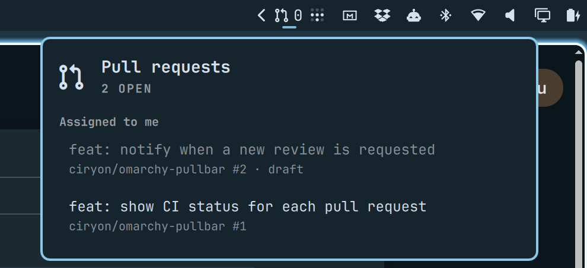

# Pullbar

Open GitHub pull requests waiting on you, in the Omarchy bar.

The bar shows how many pull requests have your review requested. The popup
lists them grouped by why they concern you — review requested, assigned to
you, opened by you — and clicking one opens it in your browser.



## Requirements

- Omarchy with the Quickshell-based Omarchy shell
- [GitHub CLI](https://cli.github.com/) (`gh`), authenticated: `gh auth login`
- `bash` (used to run the bundled `prs.sh` helper)

No API tokens are stored by the plugin; every query runs through your existing
`gh` login.

## Install

```bash
omarchy plugin add https://github.com/ciryon/omarchy-pullbar --enable
```

The plugin installs to `~/.config/omarchy/plugins/io.github.ciryon.pullbar/`.
To place it in a specific bar section:

```bash
omarchy plugin enable io.github.ciryon.pullbar right
```

## Remove

```bash
omarchy plugin disable io.github.ciryon.pullbar
omarchy plugin remove io.github.ciryon.pullbar
```

`remove` deletes the plugin directory and its entry in
`~/.config/omarchy/shell.json`. Nothing else in your configuration is touched,
and no files are written outside the plugin directory.

## Usage

| Action | Result |
|--------|--------|
| Left click | Open or close the pull request list |
| Right click | Refresh now |
| `↑` / `↓` | Move through the list |
| `Enter` | Open the selected pull request in the browser |
| `r` | Refresh |
| `Esc` | Close |

Drafts are dimmed and labelled. A pull request appearing in more than one
group is listed once, under the first group that matches.

## Settings

Configure these in the bar widget settings, or directly in the plugin's entry
in `~/.config/omarchy/shell.json`:

| Setting | Default | Meaning |
|---------|---------|---------|
| `refreshIntervalSec` | 300 | How often pull requests are fetched, in seconds |
| `maxPerSection` | 10 | Maximum pull requests fetched per group |

## IPC

```bash
omarchy-shell io.github.ciryon.pullbar toggle
omarchy-shell io.github.ciryon.pullbar refresh
omarchy-shell io.github.ciryon.pullbar count    # review requests awaiting you
```

## How it works

`prs.sh` runs three `gh search prs` queries (`--review-requested=@me`,
`--assignee=@me`, `--author=@me`) and prints one JSON object. `Panel.qml`
polls that script on a timer and renders the result. A failing query degrades
to an empty group rather than an error.

## License

MIT — see [LICENSE](LICENSE).
